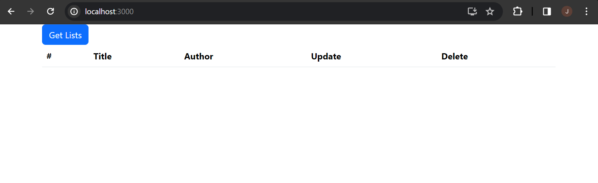
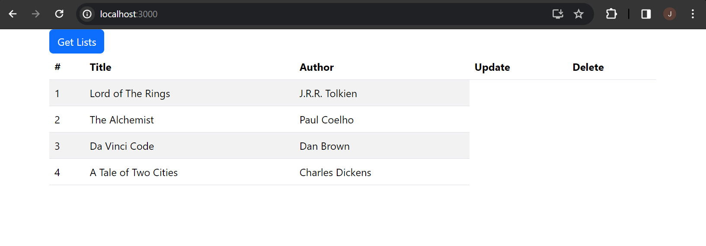

# web603-class-w3d2

## Getting started

### Step 1: Initiate A React App
Run
```bash
$ npx create-react-app crud-json-server
```
to create the application with root `crud-json-server/`.

### Step 2: Install Dependencies and 
Inside `crud-json-serve` (do `cd crud-json-server/` if needed), install `json-server` and `concurrently` by
```bash
$ npm i -D json-server concurrently
```

And then install Bootstrap (for styling) by
```bash
$ npm install bootstrap
```

### Step 3: Check Configs
Make sure that `crud-json-server/package.json` contains
```json
  "devDependencies": {
    "concurrently": "^8.2.2",
    "json-server": "^1.0.0-alpha.22"
  }
```
*(version might be different)*

and has `"json-server"` and `"dev"` added by you based on the instruction.
```json
  "scripts": {
    "start": "react-scripts start",
    "build": "react-scripts build",
    "test": "react-scripts test",
    "eject": "react-scripts eject",
    "json-server": "json-server --watch db.json --port 5000",
    "dev": "concurrently \"npm start\" \"npm run json-server\""
  }
```

## Output
Start the app by running
```bash
$ npm run dev
```
in the application root `crud-json-server/`.

After the webpack has been compiled successfully, you should be able to see this as the homepage:



Click the button "Get Lists", you should be able to see data.


